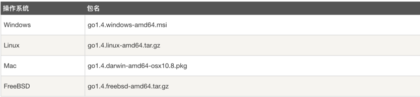
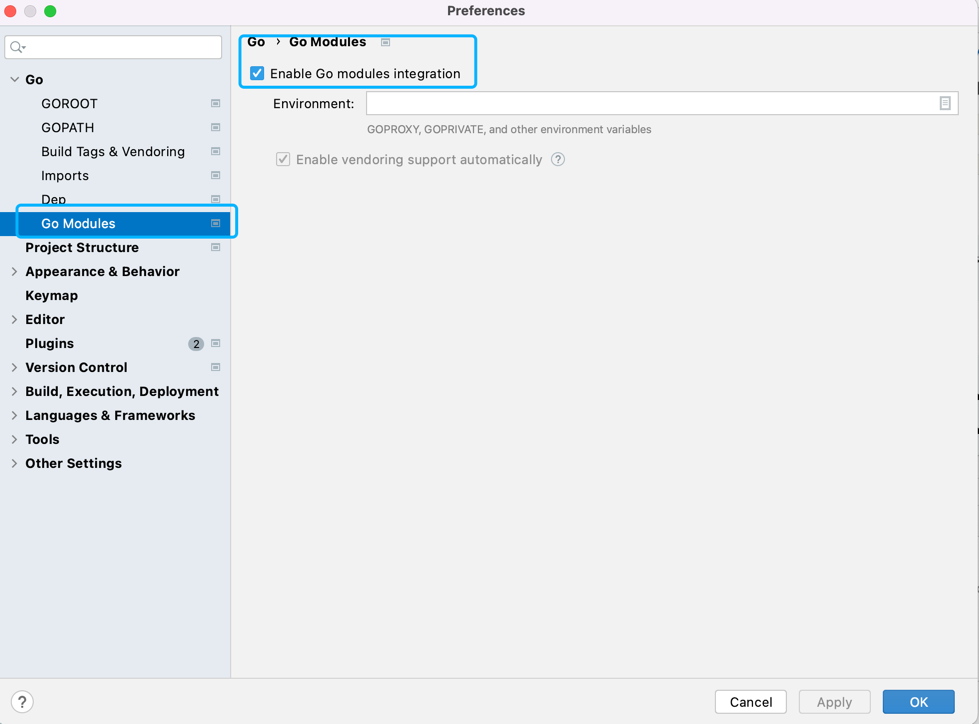

# 后端程序运行

### 一、架构

#### 后端
开发语言：golang

框架：go-zero、xorm、jwt

存储：minIO 对象存储

#### 前端
Vue2 + Electron +Element-UI

### 二、环境准备
1、golang 安装

安装包下载地址为：https://golang.org/dl/。

如果打不开可以使用这个地址：https://golang.google.cn/dl/。



2、开启go-module

``` shell
set GO111MODULE=on    //windows
export GO111MODULE=on //linux
```

3、goland无法下载包解决



### 三、MinIO 对象存储安装

<font color="red">推荐使用docker进行部署,我使用的是docker-compose进行部署的</font>

1、 docker-compose配置文件附上
```yaml
version: '3'
services:
  minio:
    image: minio/minio
    container_name: minio
    ports:
      - 9000:9000
      - 9991:9991
    environment:
      MINIO_ACCESS_KEY: admin    #管理后台用户名
      MINIO_SECRET_KEY: password #管理后台密码，最小8个字符
    volumes:
      - /opt/app/minio/data:/data               #映射当前目录下的data目录至容器内/data目录
      - /opt/app/minio/config:/root/.minio/     #映射配置目录
    command: server /data --console-address ":9991"
    privileged: true
    restart: always
```

2、docker和docker-compose安装请自行百度或google

### 四、配置修改

1、修改参数常量

define->define.go

```go
var Endpoint = "loaclhost:9000" //MinIo对象存储的地址
var AccessKeyID = "cloud-disk" //MinIo AccessKey id
var SecretAccessKey = "cloud-disk" //MinIo SecretAccessKey
var BucketName = "cloud-disk" //MinIo 的桶名称
var BucketLocation = "beijing" //MinIo 桶所在地，国内默认写beijing即可
```

2、修改配置文件数据库配置

etc-> cloud-api.yaml
```yaml
Name: cloud-api
Host: 0.0.0.0
Port: 8080

DataBase:
  Type: "mysql"
  Url: "root:password@tcp(mysql:3306)/cloud-disk?charset=utf8" #修改成自己的数据库链接地址和密码
  MaxIdleConns: 10
  MaxOpenConns: 20
  #是否显示sql语句
  ShowSql: true
Redis:
  Addr: "loaclhost:6379" #redis的链接地址和密码
  Password: "password"
  PoolSize: 10
```

### 五、初始化数据库

将doc->sql-cloud-disk.sql 导入到数据库中

### 六、后端运行
``` shell
 #运行程序
 go run cloud.go -f etc/cloud-api.yaml
 #API生成命令
 goctl api go -api cloud-disk.api -dir . -style goZero
```
